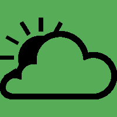

A free / open source weather forecast app based on data of german [DWD](https://opendata.dwd.de).

## About

Bicyweather is an app that shows the actual weather and a 7-day's weather forecast based on data of german weatherstations (DWD) 

## Features

- very simple weather forecast, easy to use, easy to read
- 7-day's forecast at a glance
- clustered columns showing different times of day: 9am / 12am / 3pm / 6pm (raw data also available for every hour, but fixed times used here)
- weather forecast and current weather information for 7 day's for a plenty of german (DWD weatherstations) and european cities 
- last weather forecast is stored in a database and can be watched offline
- Access rights to access "photo and media" required in order to download the weather information files from DWD server
- a map of (nearby) all german weather stations is available inside the app to find your location

## A different approach 

Once you press the "update" button, two very little files (~370kB incl. unzipped file) from [DWD](https://opendata.dwd.de) server will be downloaded and stored into Android's internal storage: the weather forecast file and the file that contains the actual weather information. This informations for your choosen location will be evaluated: min/max temperatures will be separated, the "number" which represents the weather will be translated into an icon (according to SYNOP) and displayed on the main screen. 
In the background, every new "update" overwrites the downloaded files and the evaluated information will be stored in a database (~20kB). So you can see the once downloaded weather forecast after the next start even there is no Wifi/5G available.  

## Open Source License

Unless explicitly stated otherwise all files in this repository are licensed under the [GNU General Public License v3.0](https://www.gnu.org/licenses/gpl-3.0-standalone.html). All projects **must** properly attribute [The Original Source](https://github.com/phasenrauscher/Weather).

/*
 * Bicyweather - easy weather forecast using data from DWD Germany
 * Copyright (C) 2023 Phasenrauscher
 *
 * This program is free software: you can redistribute it and/or modify
 * it under the terms of the GNU General Public License as published by
 * the Free Software Foundation, either version 3 of the License, or
 * (at your option) any later version.
 *
 * This program is distributed in the hope that it will be useful,
 * but WITHOUT ANY WARRANTY; without even the implied warranty of
 * MERCHANTABILITY or FITNESS FOR A PARTICULAR PURPOSE.  See the
 * GNU General Public License for more details.
 *
 * You should have received a copy of the GNU General Public License
 * along with this program.  If not, see <https://www.gnu.org/licenses/>.
 */

An unmodified copy of the above license text must be included in all forks.

## External Credits

 1. The weather data are used from [DWD](https://opendata.dwd.de/weather), own elements added, some data averaged, extracted or new interpreted. licensed under CC BY 4.0., see [copyrights](https://www.dwd.de/DE/service/rechtliche_hinweise/rechtliche_hinweise_node.html).
 2. The uMap project: [umap](https://umap.openstreetmap.de/de)
 3. OpenStreetMap®, licensed under the Open Data Commons Open Database License (ODbL) by the OpenStreetMap Foundation, see [copyrights](https://www.openstreetmap.org/copyright) 
 4. PDF viewer: Copyright 2017 Bartosz Schiller [AndroidPdfViewer](https://github.com/barteksc/AndroidPdfViewer)
 5. This project is inspired by:  [Matthew Petroff's "Kindle Weather Display"](https://mpetroff.net/2012/09/kindle-weather-display/)
	Weather Icon licenses - Creative Commons (CC):

    Matthew Petroff, „Weather Icons - wind.svg“, 	CC BY 1.0 [Weather_Icons_-_wind.svg](https://commons.wikimedia.org/wiki/File:Weather_Icons_-_wind.svg) 
    Matthew Petroff, „Weather Icons - fg.svg“, 	    CC BY 1.0 [Weather_Icons_-_fg.svg](https://commons.wikimedia.org/wiki/File:Weather_Icons_-_fg.svg) 
    Matthew Petroff, „Weather Icons - bkn.svg“, 	CC BY 1.0 [Weather_Icons_-_bkn.svg](https://commons.wikimedia.org/wiki/File:Weather_Icons_-_bkn.svg) 
    Matthew Petroff, „Weather Icons - dust.svg“, 	CC BY 1.0 [Weather_Icons_-_dust.svg](https://commons.wikimedia.org/wiki/File:Weather_Icons_-_dust.svg) 
    Matthew Petroff, „Weather Icons - few.svg“, 	CC BY 1.0 [Weather_Icons_-_few.svg](https://commons.wikimedia.org/wiki/File:Weather_Icons_-_few.svg) 
    Matthew Petroff, „Weather Icons - fzra.svg“, 	CC BY 1.0 [Weather_Icons_-_fzra.svg](https://commons.wikimedia.org/wiki/File:Weather_Icons_-_fzra.svg) 
    Matthew Petroff, „Weather Icons - fzrara.svg“, 	CC BY 1.0 [Weather_Icons_-_fzrara.svg](https://commons.wikimedia.org/wiki/File:Weather_Icons_-_fzrara.svg) 
    Matthew Petroff, „Weather Icons - hi shwrs.svg“,CC BY 1.0 [Weather_Icons_-_hi_shwrs.svg](https://commons.wikimedia.org/wiki/File:Weather_Icons_-_hi_shwrs.svg) 
    Matthew Petroff, „Weather Icons - ip.svg“, 	    CC BY 1.0 [Weather_Icons_-_ip.svg](https://commons.wikimedia.org/wiki/File:Weather_Icons_-_ip.svg) 
    Matthew Petroff, „Weather Icons - mist.svg“, 	CC BY 1.0 [Weather_Icons_-_mist.svg](https://commons.wikimedia.org/wiki/File:Weather_Icons_-_mist.svg) 
    Matthew Petroff, „Weather Icons - mix.svg“, 	CC BY 1.0 [Weather_Icons_-_mix.svg](https://commons.wikimedia.org/wiki/File:Weather_Icons_-_mix.svg) 
    Matthew Petroff, „Weather Icons - nsurtsra.svg“,CC BY 1.0 [Weather_Icons_-_nsurtsra.svg](https://commons.wikimedia.org/wiki/File:Weather_Icons_-_nsurtsra.svg) 
    Matthew Petroff, „Weather Icons - ovc.svg“, 	CC BY 1.0 [Weather_Icons_-_ovc.svg](https://commons.wikimedia.org/wiki/File:Weather_Icons_-_ovc.svg) 
    Matthew Petroff, „Weather Icons - ra.svg“, 	    CC BY 1.0 [Weather_Icons_-_ra.svg](https://commons.wikimedia.org/wiki/File:Weather_Icons_-_ra.svg) 
    Matthew Petroff, „Weather Icons - ra1.svg“, 	CC BY 1.0 [Weather_Icons_-_ra1.svg](https://commons.wikimedia.org/wiki/File:Weather_Icons_-_ra1.svg) 
    Matthew Petroff, „Weather Icons - raip.svg“, 	CC BY 1.0 [Weather_Icons_-_raip.svg](https://commons.wikimedia.org/wiki/File:Weather_Icons_-_raip.svg) 
    Matthew Petroff, „Weather Icons - rasn.svg“, 	CC BY 1.0 [Weather_Icons_-_rasn.svg](https://commons.wikimedia.org/wiki/File:Weather_Icons_-_rasn.svg) 
    Matthew Petroff, „Weather Icons - sct.svg“, 	CC BY 1.0 [Weather_Icons_-_sct.svg](https://commons.wikimedia.org/wiki/File:Weather_Icons_-_sct.svg) 
    Matthew Petroff, „Weather Icons - shra.svg“, 	CC BY 1.0 [Weather_Icons_-_shra.svg](https://commons.wikimedia.org/wiki/File:Weather_Icons_-_shra.svg) 
    Matthew Petroff, „Weather Icons - skc.svg“, 	CC BY 1.0 [Weather_Icons_-_skc.svg](https://commons.wikimedia.org/wiki/File:Weather_Icons_-_skc.svg) 
    Matthew Petroff, „Weather Icons - smoke.svg“, 	CC BY 1.0 [Weather_Icons_-_smoke.svg](https://commons.wikimedia.org/wiki/File:Weather_Icons_-_smoke.svg) 
    Matthew Petroff, „Weather Icons - sn.svg“, 	    CC BY 1.0 [Weather_Icons_-_sn.svg](https://commons.wikimedia.org/wiki/File:Weather_Icons_-_sn.svg) 
    Matthew Petroff, „Weather Icons - tsra.svg“, 	CC BY 1.0 [Weather_Icons_-_tsra.svg](https://commons.wikimedia.org/wiki/File:Weather_Icons_-_tsra.svg) 
    Matthew Petroff, „Weather Icons - hi tsra.svg“, CC BY 1.0 [Weather_Icons_-_hi_tsra.svg](https://commons.wikimedia.org/wiki/File:Weather_Icons_-_hi_tsra.svg) 

> Android is a trademark of Google LLC.
